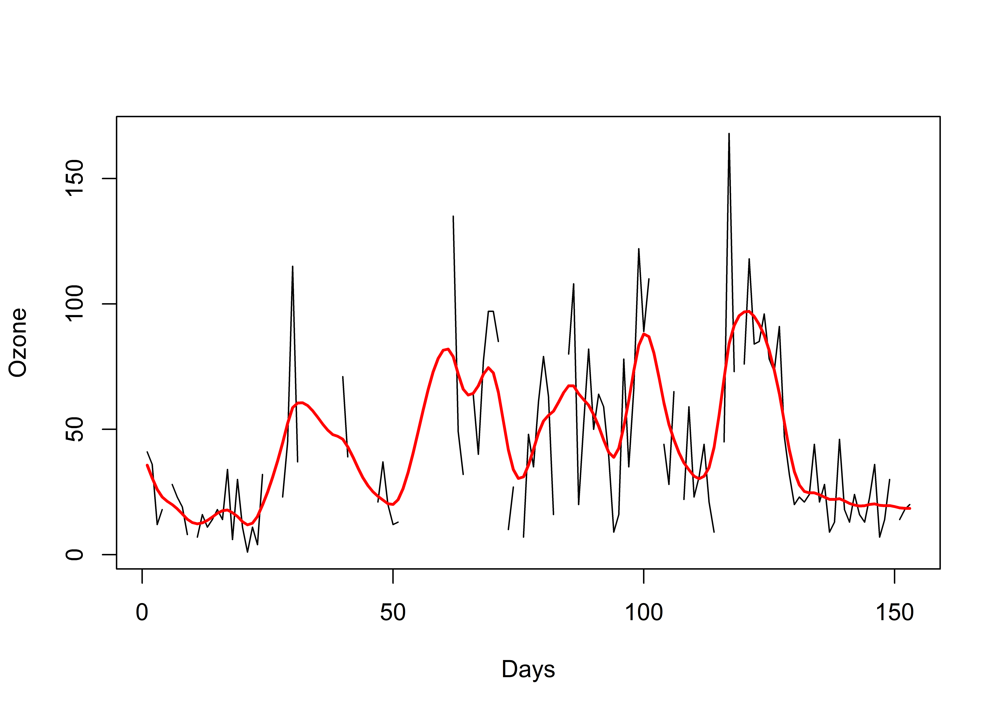

<!-- README.md is generated from README.Rmd. Please edit that file -->

# filtrs

<!-- badges: start -->

[](https://github.com/atsyplenkov/filtrs/actions/workflows/R-CMD-check.yaml)
[](https://lifecycle.r-lib.org/articles/stages.html#experimental)
[](https://CRAN.R-project.org/package=filtrs)


<!-- badges: end -->

Rust-Boosted Linear and Spatial Filtering in R.

Currently, the package supports only the Whittaker-Eilers smoother as it
is implemented in the `whittaker-eilers`
[crate](https://crates.io/crates/whittaker-eilers). Based on that
filter, a smoothing approach for spatial geometries (only single-part
`LINESTRING` for now) is proposed.

## Installation

You can install the development version of `filtrs` like so:

``` r
# install.packages(remotes)
remotes::install_github("atsyplenkov/filtrs")
```

## Time-series filtering

For equally-spaced data, one can use the `fil_wt` function as an API to
`whittaker_eilers::WhittakerSmoother`. It has two controls, `lambda` and
`order`, and interpolates missing values by default. An extremely nice
description of the smoother is written by [Andrew
Bowell](https://www.anbowell.com/blog/the-perfect-way-to-smooth-your-noisy-data).

``` r
library(filtrs)
## basic example code

data("airquality")

airquality$Ozone_smooth <- 
 fil_wt(as.double(airquality$Ozone), 10, 2)

plot(airquality$Ozone, type = "l", xlab = "Days", ylab = "Ozone")
lines(airquality$Ozone_smooth, col = "red", lwd = 2)
```



## Spatial filtering

Spatial data may not be equally spaced; it often has more nodes on the
bends of lines and fewer on straight segments. To address this
challenge, the distance between nodes—calculated using either Cartesian
or Haversine methods, depending on the Coordinate Reference System
(CRS)—is used as a positions vector in the background. The function
`fil_wt_sf` is designed to smooth a single `LINESTRING`, proving
particularly beneficial for processing high-frequency data, such as that
obtained from satellite imagery.

``` r
library(sf)
#> Linking to GEOS 3.11.2, GDAL 3.8.2, PROJ 9.3.1; sf_use_s2() is TRUE
library(smoothr)
#> 
#> Attaching package: 'smoothr'
#> The following object is masked from 'package:stats':
#> 
#>     smooth

file_path <- system.file("exdata/examples.gpkg", package = "filtrs")

lines <- 
  sf::st_read(file_path, layer = "gswe", quiet = TRUE) |>
  # Increase nodes count for smoother result
  smoothr::smooth("densify", max_distance = 10)

lines_wt <- 
  fil_wt_sf(lines, lamda = 10^-7, order = 3)

lines_smoothr <-
  smoothr::smooth(lines, method = "ksmooth",
                  smoothness = 21)
```

<details>
<summary>
Plot’s code
</summary>

``` r
par(
  mar = c(0.5, 0.5, 0.2, 0.2),
  mfrow = c(1, 2),
  oma = c(0, 0, 0.2, 0.2)
)

plot(
  sf::st_geometry(lines),
  col = "grey30",
  lwd = 3.5
)
plot(
  sf::st_geometry(lines_wt),
  col = 'firebrick3',
  lwd = 2,
  add = TRUE
)

# Add the legend
legend(
  "bottomleft",
  legend = c("Original", "{filtrs}", "{smoothr}"),
  col = c("grey30", "firebrick3", "dodgerblue3"),
  lwd = c(3, 3)
)

plot(
  sf::st_geometry(lines),
  col = "grey30",
  lwd = 3.5
)
plot(
  sf::st_geometry(lines_smoothr),
  col = 'dodgerblue3',
  lwd = 2,
  add = TRUE
)
```

</details>


Similar filtering can be achieved via the
[`smoothr`](https://github.com/mstrimas/smoothr) R package; however, the
Rust-based approach outperforms in speed when high-order smoothing is
needed. For example, 182 nodes were filtered 30 times faster using the
`filtrs` package rather than `smoothr`.

``` r
bench::mark(
  filtrs = fil_wt_sf(lines, lamda = 10^-7, order = 3),
  smoothr = smoothr::smooth(lines, method = "ksmooth", smoothness = 21),
  check = F,
  relative = T
)
#> # A tibble: 2 × 6
#>   expression   min median `itr/sec` mem_alloc `gc/sec`
#>   <bch:expr> <dbl>  <dbl>     <dbl>     <dbl>    <dbl>
#> 1 filtrs       1      1        32.4      1        2.95
#> 2 smoothr     35.6   34.1       1        8.19     1
```

## Similar packages

As linear and spatial filters are pretty common, there is no shortage of
analogs.

- **[smoothr](https://github.com/mstrimas/smoothr)** - Spatial feature
  smoothing written in base R. However, there is no Whittaker-Eilers
  smoother.

- **[phenofit](https://github.com/eco-hydro/phenofit)** - As part of
  vegetation phenology, Whittaker-Eilers and Savitzky-Golay time-series
  filtering is implemented using Rcpp. No spatial filtering.

- **[signal](https://cran.r-project.org/web/packages/signal/index.html)** -
  A set of signal processing functions originally written for ‘Matlab’
  and ‘Octave’. No spatial filtering.
